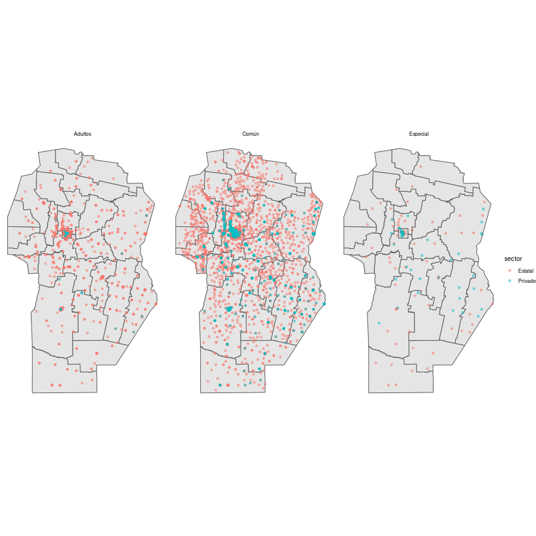

Proyecto Geolocalización en R 2021
================
Illak Zapata

## Carga de librerias

``` r
library(sf)
library(tidyverse)
```

## Carga de datos

Se obtienen los datos mediante geoservicios de [Mapas
Córdoba](https://www.mapascordoba.gob.ar/#/geoservicios). Vamos a
trabajar con dos dataset geográficos:

-   Departamentos de Córdoba
-   Establecimientos educativos

``` r
establecimientos_ed <- st_layers("WFS:https://idecor-ws.mapascordoba.gob.ar/geoserver/idecor/Establecimientos_educativos/wfs?getcapabilities")
departamentos_cba <- st_layers("WFS:https://idecor-ws.mapascordoba.gob.ar/geoserver/idecor/departamentos/wfs?getcapabilities")


# Establecimientos educativos
baseurl1 <- "https://idecor-ws.mapascordoba.gob.ar/geoserver/idecor/Establecimientos_educativos/wfs?request=GetFeature&service=WFS&typeName="
capa_wfs1 <- "idecor:Establecimientos_educativos"
establecimientos <- st_read(paste0(baseurl1,capa_wfs1))
```

    ## Reading layer `Establecimientos_educativos' from data source `https://idecor-ws.mapascordoba.gob.ar/geoserver/idecor/Establecimientos_educativos/wfs?request=GetFeature&service=WFS&typeName=idecor:Establecimientos_educativos' using driver `GML'
    ## Simple feature collection with 6311 features and 12 fields
    ## Geometry type: POINT
    ## Dimension:     XY
    ## Bounding box:  xmin: 4245400 ymin: 2415727 xmax: 6069750 ymax: 6739150
    ## Projected CRS: POSGAR 98 / Argentina 4

``` r
establecimientos <- st_transform(establecimientos, crs=4326)

# Departamentos
baseurl2 <- "https://idecor-ws.mapascordoba.gob.ar/geoserver/idecor/departamentos/wfs?request=GetFeature&service=WFS&typeName="
capa_wfs2 <- "idecor:departamentos"
departamentos <- st_read(paste0(baseurl2, capa_wfs2))
```

    ## Reading layer `departamentos' from data source `https://idecor-ws.mapascordoba.gob.ar/geoserver/idecor/departamentos/wfs?request=GetFeature&service=WFS&typeName=idecor:departamentos' using driver `GML'
    ## Simple feature collection with 26 features and 3 fields
    ## Geometry type: MULTISURFACE
    ## Dimension:     XY
    ## Bounding box:  xmin: 4235427 ymin: 6123609 xmax: 4614919 ymax: 6736737
    ## Projected CRS: POSGAR 98 / Argentina 4

``` r
# Casteamos a GEOMETRYCOLLECTION sino no funciona el join (ES UN MULTISURFACE)
departamentos <- st_cast(departamentos, "GEOMETRYCOLLECTION") %>% st_collection_extract("POLYGON")
departamentos <- st_transform(departamentos, crs=4326)

# Esto NO funciona
#establecimientos_filtrados <- st_join(establecimientos, departamentos)

# Esto SI funciona
establecimientos_filtrados <- st_filter(establecimientos, departamentos, .predicate = st_intersects) %>% 
  filter(oferta != "Común - Jardín de infantes")
```

## Graficamos a modo de prueba

Para probar los dataset realizamos la gráfica de los departamentos y
establecimientos haciendo diferencia por modalidad y sector.

``` r
ggplot() +
  geom_sf(data = departamentos) +
  geom_sf(data = establecimientos_filtrados, aes(color = sector), alpha = .5) +
  facet_wrap(vars(modalidad)) +
  theme_void()
```

<!-- -->

## Gráfica principal

La idea es obtener una visualización que nos permita responder a la
pregunta:

¿Cuántos establecimientos educativos (rurales y urbanos) existen a 125KM
de los Institutos de Formación Docente asociados?

``` r
# Listado de IFDA. Armamos un listado de forma manual de los IFDA que nos interesan.
ifda_lista <- st_as_sf(data.frame(latitude = c(-30.8571764,-31.7275439,-32.174242,-32.397557,-31.4305685,-33.1268737,-34.1328932), 
                                  longitude = c(-64.5298422,-65.006453,-64.1156697,-63.2500767,-62.0835059,-64.3528865,-63.3937023),
                                  instituto = c("Instituto Superior Dr. Bernardo Houssay\n – Capilla del Monte.",
                                                "Instituto Superior Dr. Carlos María Carena\n – Mina Clavero.",
                                                "Conservatorio Superior de Música “Juan José Castro”\n – Río Tercero",
                                                "Instituto de Educación Superior del\n Centro de La República Dr. Ángel Diego Márquez INESCER\n – Villa María.",
                                                "Colegio Superior San Martín\n – San Francisco.",
                                                "Escuela Normal Superior Justo José de Urquiza\n – Río Cuarto.",
                                                "Instituto de Enseñanza Superior Eduardo Lefebvre\n – Laboulaye.")), 
                       coords = c("longitude", "latitude"),
                       crs = 4326,
                       agr = "constant")

# Pasamos a un CRS que mida en metros para luego poder usar la misma medida con st_buffer
ifda_lista <- st_transform(ifda_lista, crs = 7801)
# Calculamos circulos para cada IFDA con un radio de 120KM
dat_circles <- st_buffer(ifda_lista, dist=125000)
# Volvemos al CRS 4326
dat_circles <- st_transform(dat_circles, crs = 4326)
ifda_lista <- st_transform(ifda_lista, crs = 4326)

# Vemos intersección de los radios con las UE (establecimientos que "caen" dentro de los circulos)
intersec <- st_intersection(establecimientos_filtrados, dat_circles) %>% 
  mutate(ambito = case_when(
    str_detect(ambito, "Urbano") ~ "Urbano",
    TRUE ~ "Rural"
  )) %>% 
  mutate(ambito = factor(ambito))
```

    ## Warning: attribute variables are assumed to be spatially constant throughout all
    ## geometries

``` r
# Combinamos los circulos
dat_circles2 <- st_union(dat_circles)

# Obtenemos un vector lógico que indica si un establecimiento "cae" dentro de un circulo o no
diff <- st_intersects(establecimientos_filtrados, dat_circles2)
x2 <- map_lgl(diff, function(x) {
  if (length(x) == 1) {
    return(TRUE)
  } else {
    return(FALSE)
  }
})

# Conjunto de establecimientos que NO cae dentro de los circulos (por fuera)
diff2 <- establecimientos_filtrados[!x2,]

# Graficamos
ggplot() +
  geom_sf(data = departamentos) +
  geom_sf(data = dat_circles2, alpha = .3) +
  geom_sf(data = intersec, aes(color = ambito), alpha = .5) +
  geom_sf(data = diff2, alpha = .1) +
  theme_void() +
  labs(
    title = "Institutos de Formación Docente asociados y establecimientos a 125KM",
    subtitle = "En capital hay 4 IFDA"
  ) +
  theme(
    plot.title.position = "plot"
  )
```

<!-- -->
